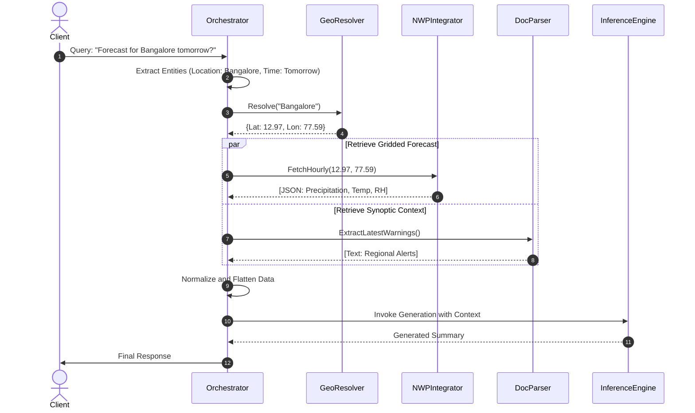

# Agentic AI Weather Assistant: Technical Case Study

## Executive Summary

The dissemination of meteorological information has historically been constrained by the highly structured, numerical nature of weather forecasting models. Traditional Numerical Weather Prediction (NWP) models produce multidimensional arrays representing atmospheric variables across temporal and spatial grids. While national meteorological organizations also publish textual weather bulletins and synoptic summaries, these documents are typically formatted as complex, multi-column PDFs designed for human domain experts. This creates a significant accessibility barrier: the raw data is technically rigorous but computationally opaque to non-specialists, and the qualitative reports are structurally difficult to parse programmatically.

The Agentic AI Weather Assistant was developed to address this structural limitation. By introducing an autonomous, agentic orchestrator built upon a Retrieval-Augmented Generation (RAG) architecture, the system acts as an intelligent translation layer. It accepts natural language queries regarding weather conditions, autonomously determines the precise spatial coordinates and temporal forecast intervals required, executes data retrieval against internal APIs and document stores, and synthesizes the returned data into coherent, constrained natural language. 

Unlike conventional search-and-summarize tasks, meteorological workflows introduce unique constraints regarding data volatility and hallucination. A weather forecast generated twelve hours ago is often operationally obsolete. Consequently, relying on a static vector database for context retrieval is ineffective. This project leverages an API-centric, dynamic retrieval paradigm where the Large Language Model (LLM) is strictly grounded by real-time data fetched at the moment of query. Furthermore, the architecture explicitly decouple the LLM's pre-trained knowledge from its generation capabilities, enforcing strict fallback protocols that compel the model to decline answering if the data retrieval layer fails, thereby mitigating the severe operational risks associated with meteorological hallucination.

## System Architecture

The architecture is designed as a decoupled, modular pipeline separating intention routing, data acquisition, and semantic generation.

### High-Level Architecture Diagram

```mermaid
graph TD
    UserQuery[User Request] --> Orchestrator
    
    subgraph Orchestrator [Agentic Orchestrator]
        IntentClassifier[Intent Classification]
        EntityExtractor[Temporal & Spatial Extraction]
        ToolRouter[Tool Selection Router]
    end
    
    subgraph Retrieval Layer
        GeoResolver[Location Resolution Engine]
        NWPFetcher[Gridded NWP Integrator]
        DocScraper[Spatial PDF Parser]
    end
    
    subgraph External Systems
        GeoDB[(Coordinate Database)]
        MausamgramAPI[Internal Weather API]
        BulletinPortal[Internal Press Release Portal]
    end
    
    subgraph Synthesis Layer
        ContextBuilder[Prompt Context Aggregator]
        LLM[Inference Engine]
        Verifier[Grounding Verification]
    end
    
    Orchestrator --> Retrieval Layer
    Retrieval Layer <--> External Systems
    Retrieval Layer --> Synthesis Layer
    Synthesis Layer --> FinalResponse[Natural Language Output]
```

### Subsystem: Agentic Orchestrator
* **Purpose:** Serves as the central state machine dictating the flow of execution based on semantic analysis of the input query.
* **Responsibilities:** Analyzes the natural language query, identifies the absence of necessary state variables (such as explicit latitude and longitude), and executes retrieval functions iteratively until the state is sufficient for response generation.
* **Inputs:** Unstructured text strings from the client interface.
* **Outputs:** Execution commands mapped to specific retrieval functions and normalized prompt templates.
* **Interaction:** Continuously polls the Retrieval Layer. It utilizes a Reasoning and Acting (ReAct) prompting strategy to decide whether additional data gathering is required before transferring control to the Synthesis Layer.

### Subsystem: Retrieval Layer
* **Purpose:** Acts as the translation and network boundary between the agent and legacy meteorological systems.
* **Responsibilities:** Manages HTTP requests, handles network latency and retry logic, parses complex JSON responses, and executes spatial document extraction algorithms.
* **Inputs:** Parameterized arguments (e.g., specific coordinate floats, forecast horizon enumerators).
* **Outputs:** Normalized, flattened JSON arrays and sanitized text blocks.
* **Interaction:** Entirely stateless. It receives precise instructions from the Orchestrator, interfaces with external APIs, and returns raw data objects.

### Subsystem: Inference Engine
* **Purpose:** Transforms highly structured, abstract meteorological data into human-readable narratives.
* **Responsibilities:** Token generation and strict adherence to system-level constraints regarding tone, formatting, and data grounding.
* **Inputs:** A composite string containing the system instruction, the user query, and the retrieved context block.
* **Outputs:** Generated text tokens.
* **Interaction:** Abstracted behind a provider interface, allowing the Orchestrator to route queries to different underlying models (local vs. cloud) based on predefined security or latency heuristics.

### Request Flow Sequence Diagram



## Retrieval-Augmented Generation

Retrieval-Augmented Generation was selected as the foundational architecture to solve the primary deficiency of Large Language Models: their inability to provide temporally accurate, highly localized, and factually rigorous information out-of-the-box. 

### Context Grounding and Hallucination Risks
In meteorological applications, the tolerance for AI hallucination is zero. A model fabricating a clear forecast during a severe weather event presents unacceptable operational risks. The RAG architecture implemented here shifts the responsibility of factual accuracy entirely away from the LLM's pre-trained weights and onto the retrieval layer. The LLM is explicitly instructed via system prompts to act solely as a text summarization engine, operating strictly within the bounds of the provided context window.

### Weather-Specific Retrieval Challenges
Standard RAG architectures utilizing document chunking, embeddings, and vector databases fail when applied to NWP grids. Weather models output matrices of floats representing atmospheric variables at specific coordinates and timesteps. Embedding this data destroys its structure. Consequently, the retrieval pipeline was designed to be API-centric. Instead of querying a static database, the system constructs parameterized REST calls to live forecasting endpoints, ensuring the retrieved context represents the absolute latest operational run of the weather model.

### Context Construction Strategies
The raw JSON returned by the NWP systems is excessively verbose, containing metadata, server variables, and deep nesting. Passing this raw output to an LLM rapidly exhausts the context window and dilutes the model's attention mechanism. The context construction module employs aggressive key-filtering, discarding all non-essential data and flattening the remaining variables into a concise key-value text representation before injection into the prompt.

## Large Language Model Layer

The inference architecture features a dual-execution strategy to manage the competing priorities of reasoning capability, network latency, and strict data privacy.

### Cloud Inference Architecture
For queries lacking sensitive internal identifiers or experimental validation workflows, the system routes traffic to Hugging Face serverless endpoints utilizing models such as Gemma. Cloud inference provides access to models with higher parameter counts, yielding superior reasoning performance when interpreting complex or highly ambiguous natural language queries. The primary tradeoff involves network latency and the requirement to transmit queries outside the secure internal network.

### Local Inference Architecture
To support operations requiring absolute data sovereignty, the system integrates local execution utilizing `llama.cpp` on High-Performance Computing (HPC) nodes. The primary model evaluated for local deployment was Zephyr-7B, quantized to 4-bit representation (GGUF). 
Local deployment guarantees that internal proprietary data and sensitive queries remain within the air-gapped network. Furthermore, running quantized models on dedicated GPU clusters provides highly predictable, consistent latency profiles independent of external network conditions. The primary engineering challenge was optimizing the context window; a 7B model is highly susceptible to attention degradation when processing thousands of tokens of flattened JSON data, necessitating the strict data trimming methodologies implemented in the retrieval layer.

## Weather Data Integration

The system aggregates disparate meteorological data sources, normalizing them into a unified semantic format.

### Meteorological Data Ingestion and Normalization
The primary data source is the internal gridded forecasting API, which provides point forecasts based on latitude and longitude. The integration pipeline accepts coordinate inputs, executes the query, and receives time-series data. The normalization engine translates internal meteorological codes into standard text (e.g., converting a numeric weather code into "Moderate Rain") before appending the data to the LLM context, reducing the cognitive load on the inference engine.

### Location-Aware Retrieval
Because the internal APIs require precise numerical coordinates, the system implements a dedicated location resolution pipeline. It utilizes an internal curated database of geographic entities mapped to coordinates. If a user queries a colloquial location string, the system executes a fuzzy-matching algorithm to identify the closest valid geographical entity before initiating the meteorological retrieval, effectively translating human geography into machine geometry.

### Weather Bulletin Integration
To supplement the highly localized numerical data with broader synoptic context, the integration layer includes a document parsing module. It automatically scrapes the latest regional press releases and PDF weather bulletins. Converting structured PDF tables into machine-readable text is notoriously difficult due to layout irregularities. The system utilizes spatial parsing techniques (`pdfplumber`) relying on bounding boxes and coordinate extraction to reconstruct tables and extract impact-based warnings reliably.

## Engineering Challenges

### Retrieval Relevance and Context Window Limitations
A persistent challenge involved managing the volume of retrieved data. A request for a 10-day hourly forecast exceeds the effective context limits of smaller local models. The solution required engineering pre-computation logic within the orchestrator: if a user asks for tomorrow's forecast, the system programmatically filters the API response, discarding data outside the relevant 24-hour window *before* the data reaches the LLM context buffer.

### Hallucination Reduction
Early iterations of the system demonstrated a tendency to guess weather conditions if the retrieval API timed out. This was resolved by implementing strict programmatic failure paths. If the retrieval layer returns an error or an empty dataset, the orchestrator bypasses the standard prompt template and explicitly forces the LLM to output a predefined error message indicating data unavailability, entirely circumventing the model's generation capabilities.

### Multi-Source Data Aggregation
The LLM struggled to synthesize structured quantitative data (temperature floats) alongside unstructured qualitative data (paragraphs from press releases) when presented sequentially. The prompt engineering strategy was modified to physically isolate the data sources within the prompt using explicit markdown demarcations (e.g., `[LOCAL GRIDDED FORECAST]` vs. `[NATIONAL SYNOPTIC WARNINGS]`). This isolation significantly improved the model's ability to cross-reference and synthesize the disparate data types.

## My Contributions

This project involved orchestrating access to pre-existing numerical weather prediction models and API infrastructure. My specific contributions were centered entirely on the software architecture and AI engineering required to build the Agentic layer:

* **Agentic Orchestrator Development:** Designed and implemented the core state machine and Tool Router utilizing LangChain, enabling autonomous decision-making based on semantic analysis of user input.
* **Retrieval Pipeline Engineering:** Built the Python integration layers capable of querying, parsing, and normalizing the raw JSON output from the internal gridded APIs.
* **Spatial Document Extraction:** Engineered the complex `pdfplumber` extraction scripts utilizing regex and spatial coordinate mapping to reliably reconstruct tabular warning data from unstructured meteorological PDFs.
* **Inference Engine Orchestration:** Configured the local deployment environment using `llama.cpp` on the HPC cluster, managing quantization parameters and optimizing context window utilization.
* **Parameter-Efficient Fine-Tuning (PEFT):** Developed LoRA fine-tuning pipelines utilizing the TRL library to adapt foundational models to specific meteorological phrasing and terminology.
* **System Validation and Reliability:** Implemented the context grounding constraints and the "fail-closed" error handling logic critical for preventing hallucination.

## Lessons Learned

### Building Production-Oriented AI Systems
Deploying Large Language Models in domains demanding high factual rigor fundamentally alters the engineering priorities. The primary objective is not maximizing generative fluency, but rather maximizing constraint. Extensive engineering effort must be directed toward writing robust validation logic that monitors the input state and the output generation, ensuring the model operates strictly as a summarization engine rather than an independent reasoning agent.

### The Limitations of Standard RAG Architectures
The assumption that RAG equates to chunking documents into a vector database is incorrect when applied to structured, highly volatile data. Vector semantic search is the wrong tool for retrieving the current temperature at a specific coordinate. Building robust AI systems requires evaluating the fundamental nature of the underlying data and constructing API-centric retrieval layers capable of querying live endpoints rather than static embeddings.

### Deployment Realities of Local Inference
While local inference provides necessary security guarantees, it requires deep optimization of the software stack. Handling out-of-memory errors, managing context window degradation, and optimizing token generation speeds on internal hardware are significant infrastructure challenges that must be addressed alongside prompt engineering and model selection.
