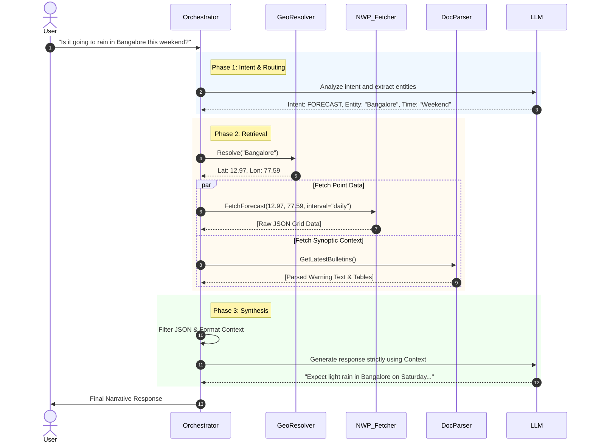

# Agentic Workflow & RAG Pipeline

This document details the step-by-step logic and reasoning pipeline used by the Agentic Weather Assistant to process user requests.

## Workflow Sequence

The following sequence diagram illustrates the end-to-end data flow when a user requests a weather update.



## Pseudocode Pipeline Representation

To protect proprietary implementations, the core agent logic is represented below using high-level pseudocode:

```text
function HandleWeatherQuery(user_query):
    // 1. Initialize ReAct Agent with System Instructions
    agent = InitializeAgent(
        persona="Expert Meteorologist",
        strict_grounding=True
    )
    
    // 2. Extract Location Entities
    location_str = agent.extract_entities(user_query, type="LOCATION")
    
    if location_str is Empty:
        return "Please specify a location."

    // 3. Resolve Geographical Coordinates
    try:
        coords = GeoService.resolve(location_str)
    except LocationNotFoundError:
        return "I could not find that location. Can you provide coordinates?"

    // 4. Retrieve Structured Forecast Data
    forecast_data = []
    
    if agent.requires_hourly_data(user_query):
        raw_json = NWP_API.fetch_hourly(coords.lat, coords.lon)
        forecast_data.append(NormalizeJSON(raw_json))
    else:
        raw_json = NWP_API.fetch_daily(coords.lat, coords.lon)
        forecast_data.append(NormalizeJSON(raw_json))

    // 5. Retrieve Unstructured Warnings
    latest_bulletins = DocumentStore.fetch_recent_pdfs(days=1)
    extracted_warnings = PDFParser.extract_tables_and_text(latest_bulletins)
    
    // 6. Context Construction
    llm_context = ConstructPrompt(
        query=user_query,
        structured_data=forecast_data,
        unstructured_data=extracted_warnings
    )
    
    // 7. Inference
    response = LLM.generate(llm_context)
    
    // 8. Verification (Hallucination Check)
    if VerificationEngine.check_unsupported_claims(response, forecast_data):
        response = "I cannot confirm that forecast based on the current data."

    return response
```

### Key Workflow Decisions
- **Parallel Retrieval:** Fetching grid forecasts and scraping press releases happens asynchronously, significantly reducing overall latency.
- **Strict Grounding:** The LLM is forced to cite the retrieved data. If the retrieval layer fails to return data for a location, the LLM is explicitly prompted to decline answering rather than relying on its internal, potentially outdated training weights.
