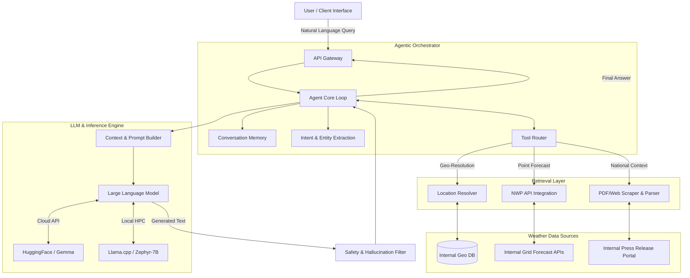

# System Architecture: Agentic AI Weather Assistant

This document outlines the high-level architecture of the Agentic AI Weather Assistant. The system was designed to securely and intelligently bridge natural language queries with complex meteorological data pipelines.

## High-Level Component Interaction

## Core Subsystems Overview

### 1. Agentic Orchestrator
The orchestrator drives the decision-making process. It receives the user query, determines what information is missing, and autonomously decides which tools (functions) to invoke to gather that information. It follows a "Reasoning and Acting" (ReAct) paradigm.

### 2. Retrieval Layer
The retrieval layer acts as a translation barrier between the AI agent and the highly structured, legacy meteorological systems.
- **Geo-Resolution:** Translates fuzzy strings like "South Mumbai" into exact latitude and longitude coordinates required by the NWP systems.
- **NWP API Integration:** Queries gridded weather models to fetch localized predictions (temperature, humidity, precipitation).
- **PDF Parser:** Scrapes recent meteorological press releases, extracting warning tables and synoptic context using spatial PDF parsing logic.

### 3. Inference Engine
The system abstracts the Large Language Model layer, allowing seamless switching between execution environments based on security requirements:
- **Cloud Execution:** Utilizes powerful models via API for lower-priority queries.
- **Local HPC Execution:** Leverages quantized models running entirely offline on internal GPU clusters for highly sensitive, air-gapped queries.

### 4. Safety & Formatting Layer
Ensures that the LLM's response strictly adheres to the data retrieved from the meteorological tools, mitigating the risk of the model hallucinating weather forecasts.
